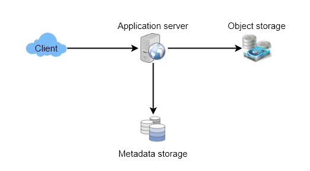
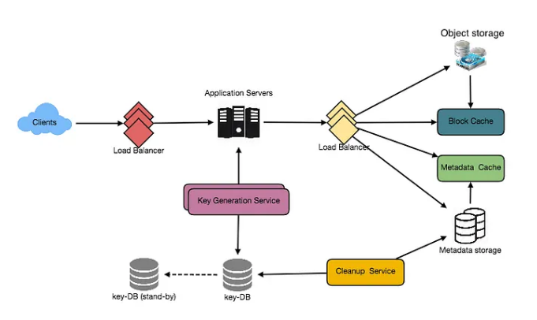

# Design a Pastebin-like service

## Introduction
Pastebin.com like services enable users to store plain text or images over the network (typically the Internet) and generate unique URLs to access the uploaded data. Such services are also used to share data over the web quickly, as users would need to pass the URL to let other users see it.

## Features
- What should be the limit on the amount of text a user can paste at a time?
  - We can limit users not to have Pastes bigger than 10MB to stop the abuse of the service.
- Should we impose size limits on custom URLs?
  - Since our service supports custom URLs, users can pick any URL they like, but providing a custom URL is not mandatory. However, it is reasonable (and often desirable) to impose a size limit on custom URLs to have a consistent URL database.

## Requirements
### Functional Requirements
- Users should upload or "paste" their data and get a unique URL to access it.
- Users will only be able to upload text.
- Data and links will automatically expire after a specific timespan; users should also specify expiration time.
- Users should optionally be able to pick a custom alias for their paste.

### Non-Functional Requirements
- The system should be highly reliable, any data uploaded should not be lost.
- The system should be highly available. This is required because if our service is down, users will not access their Pastes.
- Users should be able to access their Pastes in real-time with minimum latency.
- Paste links should not be guessable (not predictable).

## Capacity Estimation

| Category           | Metric                 | Value        | Calculation                                        |
|--------------------|------------------------|--------------|----------------------------------------------------|
| **Traffic**        | Read/Write Ratio       | 100:1        | Assumed                                            |
|                    | New Pastes per day     | `1m`         |                                                    |
|                    | New Pastes per secomd  | `10/s`       | 1M / (24 hours * 3600 seconds) ~= 10 pastes/sec    |
|                    | Read per secomd        | `1200/s`     | 100M / (24 hours * 3600 seconds) ~= 1200 reads/sec |
| **Storage**        | Max size per paste     | `10MB`       | Assumed                                            |
|                    | Avg size per paste     | `100KB`      | Assumed                                            |
|                    | Storage per day        | `100 GB/day` | 1M * 10KB = 100 GB/day                             |
|                    | Storage lifttime       | 5 years      | Assumed                                            |
|                    | Storage totally        | 180TB        | 100 GB * 365 days * 5 years ~= 180 TB              |
|                    | Total Pastes count     | `2b`         | 1M * 365 * 5 ~= 2 Billion                          |
|                    | Latters needed for URL | `6`          | Base64 encoding: 64^6 ~= 68.7 billion              |
| **BandWidth**      | Ingress per second     | 1MB/s        | 10 * 100 KB = 1 MB/s                               |
|                    | Egress per second      | 100MB/s      | 1000 * 100 KB = 100 MB/s                           |
| **Memory & Cache** | Cache principle        | 80:20 rule   | Pareto Principle (80% requests for 20% data)       |
|                    | Cache size per day     | 2TB          | 0.2 * 100 M * 100 KB ~= 2 TB                       |

## High Level Design
We need an application layer that will serve all the read and write requests at a high level.

The application layer will talk to a storage layer to store and retrieve data.

We can segregate our storage layer with one database storing metadata related to each paste, users, etc., while the other storing paste contents in some block storage or a database. This division of data will allow us to scale them individually.

## Detail Design
### API Design

---

### Database Design
A few observations about the nature of the data we are going to store:
- We need to store approximately 2 Billion records: 1 Million per day * 365 days * 5 years ~= 2 Billion
- Each metadata object we are going to store would be small (less than 100 bytes).
- Each paste object we store can be medium size (average 100KB, max 10 MB).
- There are no relationships between records, except if we want to store which user created what Paste.
- Our service is read-heavy. 100:1 read:write ratio.

#### Database Schema
We would need two tables, one for storing information about the Pastes and the other for users’ data.

| Paste Table     |               |
|-----------------|---------------|
| hash            | varchar(6)    |
| user_id         | int           |
| content_path    | varchar(256)  |
| url             | varchar(256)  |
| create_at       | timestamp     |
| expiration_date | timestamp     |

| User Table |             |
|------------|-------------|
| user_id    | int         |
| name       | varchar(32) |
| mail       | varchar(32) |
| create_at  | timestamp   |
| last_login | timestamp   |

#### Metadata Database
We can use a relational database like MySQL or a Distributed Key-Value store like Redis or Memcached. The former would be preferable for an established firm and the latter for a fast-growing startup.

#### Block Storage
We can store our contents in a distributed key-value block storage to enjoy benefits offered by NoSQL like HDFS or S3. Whenever we feel like hitting our full capacity on content storage, we can quickly increase it by adding more servers.

---

### Application Layer
Our application layer will process all incoming and outgoing requests. The application servers will be talking to the backend data store components to serve the requests.

- How to handle a write request?
  - Upon receiving a write request, our application server will generate a six-letter random string, which would serve as the key of the paste (if the user has not provided a custom key). The application server will then store the contents of the paste and the generated key in the database. After the successful insertion, the server can return the key to the user.

  - One possible problem here could be that the insertion fails because of a duplicate key. Since we are generating a random key, there is a possibility that the newly generated key could match an existing one. In that case, we should regenerate a new key and try again. We should keep retrying until we don’t see a failure due to the duplicate key. We should return an error to the user if the custom key they have provided is already present in our database.

  - Another solution to the above problem could be to run a standalone Key Generation Service (KGS) that generates random six letters strings beforehand and stores them in a database (let’s call it key-DB).

  - KGS will make sure all the keys inserted in key-DB are unique. Whenever we want to store a new paste, we will take one of the already generated keys and use it. This approach will make things quite simple and fast since we will not be worrying about duplications or collisions.

  - KGS can use two tables to store keys, one for keys not used yet and one for all the used keys. As soon as KGS gives some keys to any application server, it can move these to the used keys table. KGS can always keep some keys in memory so that whenever a server needs them, it can quickly provide them. As soon as KGS loads some keys in memory, it can move them to the used keys table. This way, we can make sure each server gets unique keys. If KGS dies before using all the keys loaded in memory, we will be wasting those keys. We can ignore these keys, given the vast number of keys we have.

- Isn’t KGS a single point of failure?
  - Yes, it is. To solve this, we can have a standby replica of KGS, and whenever the primary server dies, it can take over to generate and provide keys.

- Can each app server cache some keys from key-DB?
  - Yes, this can surely speed things up. Although in this case, if the application server dies before consuming all the keys, we will end up losing those keys. This could be acceptable since we have 68B unique six letters keys, many more than we require. (We require only 2 Billion)

- How to handle a paste read request?
  - Upon receiving a read request, the application service layer contacts the datastore. The datastore searches for the key, and if it is found, returns the paste’s contents. Otherwise, an error code is returned.

---

### Scaling (Data Partitioning and Replication)

---

### Cache

---

### Load Balancer (LB)

---

### Purging or DB cleanup

## Architecture

## FAQs

## Resources