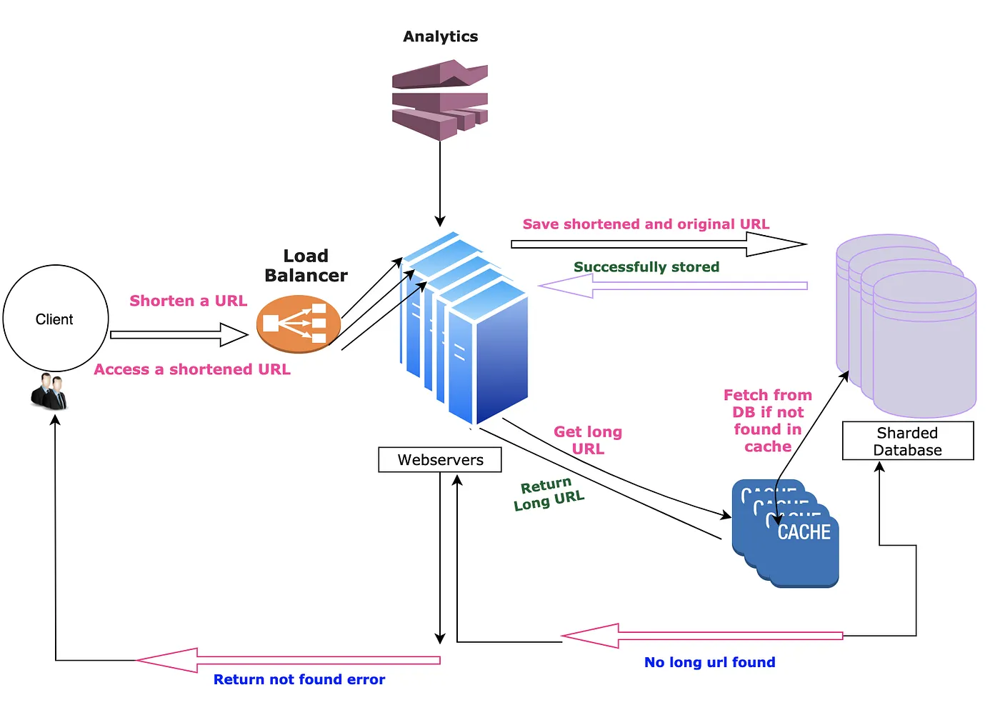
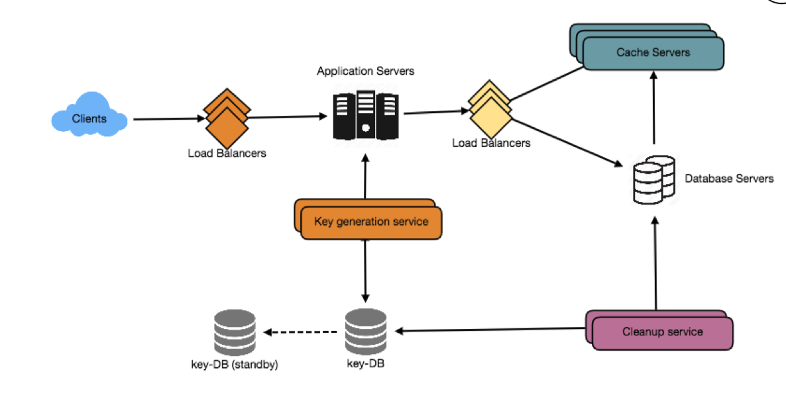

# Design a URL Shortening service like TinyURL

## Questions
- `How do you generate a unique short ID?`
- `How do you avoid collisions?`
- How do we prevent malicious links, phishing, or spam?
- `Do we rate-limit requests from abusive clients?`
- `Do we support link expiration or deletion?`
- How do we store logs for analytics?
- `Should we cache frequently accessed short URLs? Where? (Redis, CDN)`
- `How do we handle hot keys (very popular links)?`


## Introduction
A URL shortener service creates a short url/aliases/tiny url against a long url.Moreover, when user click on the tiny url, he gets redirected to original url.

Tiny url are exceedingly handy to share through sms/tweets (where there is limit to number of characters that can be messaged/tweeted) and also when they are printed in books/magazines etc.(Less character implies less printing cost). In addition, it is easy and less error prone to type a short url when compared to its longer version.

Example:
- Long URL: https://medium.com/@sandeep4.verma
- Short URL : https://tinyurl.com/3sh2ps6v

## Features
1. How long a tiny url would be ? Will it ever expire ?
   - Assume once a url created it will remain forever in system.

2. Can a customer create a tiny url of his/her choice or will it always be service generated ? If user is allowed to create customer shortened links, what would be the maximum size of custom url ?
   - Yes user can create a tiny url of his/her choice. Assume `maximum character limit to be 16`.

3. How many url shortening request expected per month ?
   - Assume `100 million` requests per month.

4. Do we expect service to provide metrics like most visited links ?
   - Yes. Service should also aggregate metrics like number of URL redirections per day and other analytics for targeted advertisements.

## Requirements
### Functional Requirements
- `Service should be able to create shortened url/links against a long url`
- `Click to the short URL should redirect the user to the original long URL`
- Shortened link should be as small as possible
- `Users can create custom url with maximum character limit of 16`
- Service should collect metrics like most clicked links
- `Once a shortened link is generated it should stay in system for lifetime`

### Non-Functional Requirements
- Service should be up and running all the time
- `URL redirection should be fast and should not degrade at any point of time (Even during peak loads)`
- Service should expose REST API’s so that it can be integrated with third party applications

## Capacity Estimation

| Category           | Metric                     | Value         | Calculation                                  |
|--------------------|----------------------------|---------------|----------------------------------------------|
| **Traffic**        | Read/Write Ratio           | 200:1         | Assumed                                      |
|                    | Shortened links per month  | `100 million` | Given requirement                            |
|                    | Shortened links per second | `~40 URLs/s`  | 100M ÷ (30 days × 24 hours × 3600 seconds)   |
|                    | Redirections per second    | `8000 URLs/s` | 40 URLs/s × 200 (read/write ratio)           |
| **Storage**        | Service lifetime           | 100 years     | Assumed                                      |
|                    | Shortened links per month  | 100 million   | Given requirement                            |
|                    | Total data objects         | 120 billion   | 100M/month × 100 years × 12 months           |
|                    | Data object size           | 500 bytes     | Short URL + Long URL + metadata              |
|                    | Total storage required     | `60 TB`       | 120 billion × 500 bytes                      |
| **Memory & Cache** | Cache principle            | 80:20 rule    | Pareto Principle (80% requests for 20% data) |
|                    | Redirections per second    | 8000 URLs/s   | From traffic calculation                     |
|                    | Requests per day           | `700 million` | 8000/s × 86400 seconds                       |
|                    | Cache percentage           | 20%           | Based on 80:20 rule                          |
|                    | Data object size           | `500 bytes`   | Same as storage calculation                  |
|                    | Cache memory required      | `~70 GB`      | 0.2 × 700M × 500 bytes                       |

## High Level Design
1. Added a load balancer in front of WebServers
2. Sharded the database to handle huge object data
3. Added cache system to reduce load on the database.



## Detail Design
### API Design

| Aspect                 | Details                                        |
|------------------------|------------------------------------------------|
| **Function Signature** | `create(long_url, api_key, custom_url)`        |
| **HTTP Method**        | POST                                           |
| **Endpoint**           | `https://tinyurl.com/app/api/create`           |
| **Request Body**       | `{url=long_url}`                               |
| **Success Response**   | OK (200), with the generated short_url in data |

- Parameters
  - `long_url`: A long URL that needs to be shortened
  - `api_key`: A unique API key provided to each user, to protect from the spammers, access, and resource control for the user, etc.
  - `custom_url (optional)`: The custom short link URL, user want to use
  - `Return Value`: The short Url generated, or error code in case of the inappropriate parameter

| Aspect                 | Details                              |
|------------------------|--------------------------------------|
| **Function Signature** | `get(short_url, api_key)`            |
| **HTTP Method**        | GET                                  |
| **Endpoint**           | `https://tinyurl.com/{short_url_id}` |

- Parameters
  - `short_url_id`: The short URL id generated from the above function.
  - `Return Value`: Return a http redirect response(302)

---

### Database Design

#### User Table
| Field             | Description                                                       |
|-------------------|-------------------------------------------------------------------|
| **User ID**       | A unique user id or API key to make user globally distinguishable |
| **Name**          | The name of the user                                              |
| **Email**         | The email id of the user                                          |
| **Creation Date** | The date on which the user was registered                         |

#### ShortLink Table
| Field            | Description                                                         |
|------------------|---------------------------------------------------------------------|
| **Short Url**    | 6/7 character long unique short URL                                 |
| **Original Url** | The original long URL                                               |
| **UserId**       | The unique user id or API key of the user who created the short URL |

---

### Shortening Algorithm
For shortening a url we can use following two solutions (URL encoding and Key Generation service). Let’s walk through each of them one by one.
- URL Encoding
  - base62
  - MD5
- Key Generation Service (KGS)

#### URL encoding through base62

Base 10 are digits [0–9], which we use in everyday life and Base 62 are [0–9][a-z][A-Z]

- URL with length 5, will give 62⁵ = ~916 Million URLs
- URL with length 6, will give 62⁶ = ~56 Billion URLs
- URL with length 7, will give 62⁷ = ~3500 Billion URLs

Since we required to produce `120 billion URLs`, with `7 characters` in base62 we will get `~3500 Billion` URLs. Hence each of tiny url generated will have 7 characters

How to get unique '7 character' long random URLs in base62 ?

Once we have decided number of characters to use in Tiny URL (7 characters) and also the base to use (base 62 [0–9][a-z][A-Z] ), then the next challenge is how to generate unique URLs which are 7 characters long.

> ##### Technique 1 —Short url from random numbers
We could just make a random choice for each character and check if this tiny url exists in DB or not. If it doesn’t exist return the tiny url else continue rolling/retrying. As more and more 7 characters short links are generated in Database, we would require several rolls before finding non-existing one short link which will slow down tiny url generation process.

> ##### Technique 2 —Short url from base conversion
Think of the seven-bit short url as a hexadecimal number (0–9, a-z, A-Z) (For e.g. aKc3K4b) . Each short url can be mapped to a decimal integer by using base conversion and vice versa.

Take the number 125 as an example, to convert 125 to base-62, we distribute that 125 across these base-62 "places." The highest "place" that can take some is 62¹, which is 62. 125/62 is 2, with a remainder of 1. So we put a 2 in the 62’s place and a 1 in the 1’s place. So our answer is 21.

For 7,912 we have this three-digit number: 2 - 3 - 38. Now, that "38" represents one numeral in our base-62 number. So we need to convert that 38 into a specific choice from our set of numerals: a-z, A-Z, and 0–9. "38th" numeral is "C." So we convert that 38 to a "C." That gives us 23C.

So we can start with a counter (A Large number 100000000000 in base 10 which 1L9zO9O in base 62) and increment counter every-time we get request for new short url (100000000001, 100000000002, 100000000003 etc.) .This way we will always get a unique short url.
  
  - 100000000000 (Base 10) ==> 1L9zO9O (Base 62)

Similarly, when we get tiny url link for redirection we can convert this base62 tiny url to a integer in base10

  - 1L9zO9O (Base 62) ==>100000000000 (Base 10)

> ##### Technique 3 —MD5 hash
The MD5 message-digest algorithm is a widely used hash function producing a 128-bit hash value(or 32 hexadecimal digits). We can use these 32 hexadecimal digit for generating 7 characters long tiny url.

- Encode the long URL using the MD5 algorithm and take only the first 7 characters to generate TinyURL.
- The first 7 characters could be the same for different long URLs so check the DB to verify that TinyURL is not used already
- Try next 7 characters of previous choice of 7 characters already exist in DB and continue until you find a unique value

Also, we could use the base64 encoding to encode the 128 bit MD5 value, will get a 21 characters (each base64 character encodes 6 bits of the hash value).

`The key issus for this method is`:
- If multiple users enter the same URL, they can get the same shortened URL, which is not acceptable. Same URL from different users, should result differently. 

#### Key Generation Service
We can have a standalone Key Generation Service (KGS) that generates random seven-letter strings beforehand and stores them in a database (let’s call it key-DB). Whenever we want to shorten a URL, we will take one of the already-generated keys and use it. This approach will make things quite simple and fast. Not only are we not encoding the URL, but we won’t have to worry about duplications or collisions. KGS will make sure all the keys inserted into key-DB are unique

- Can concurrency cause problems? 
  - As soon as a key is used, it should be marked in the database to ensure that it is not used again. If there are multiple servers reading keys concurrently, we might get a scenario where two or more servers try to read the same key from the database. How can we solve this concurrency problem?
- Servers can use KGS to read/mark keys in the database. KGS can use two tables to store keys: one for keys that are not used yet, and one for all the used keys. As soon as KGS gives keys to one of the servers, it can move them to the used keys table. KGS can always keep some keys in memory to quickly provide them whenever a server needs them.
- For simplicity, as soon as KGS loads some keys in memory, it can move them to the used keys table. This ensures each server gets unique keys. If KGS dies before assigning all the loaded keys to some server, we will be wasting those keys–which could be acceptable, given the huge number of keys we have.
- KGS also has to make sure not to give the same key to multiple servers. For that, it must synchronize (or get a lock on) the data structure holding the keys before removing keys from it and giving them to a server.
- Isn’t KGS a single point of failure? 
  - Yes, it is. To solve this, we can have a standby replica of KGS. Whenever the primary server dies, the standby server can take over to generate and provide keys.
- Can each app server cache some keys from key-DB? 
  - Yes, this can surely speed things up. Although, in this case, if the application server dies before consuming all the keys, we will end up losing those keys. This can be acceptable since we have 68B unique six-letter keys.

---

### Database Choice

- Relational Databases (RDBMS)
  - Examples: MySQL, Postgres
  - Advantages:
    - Efficient to check if URL exists in database
    - Handle concurrent writes well
    - ACID consistency
  - Disadvantages:
    - Difficult to scale

- NoSQL Databases
  - Examples: BigTable, Cassandra
  - Advantages:
    - Excellent scaling power
    - High performance for large datasets
  - Disadvantages:
    - Eventually consistent (not ACID)
    - Less suitable for complex queries

---

### Scaling (Data Partitioning and Replication)
#### [Technique 1: Short url from random numbers](#technique-1-short-url-from-random-numbers)
Our system needs to handle 60TB of storage, 40 writes/second, and 8000 reads/second. So NoSQL database (MongoDB/Cassandra) is a better choice than SQL database.

Why NoSQL?
- Better for high-volume reads/writes
- Built-in sharding and replication
- No complex joins needed for our use case
- Easier to scale than custom SQL partitioning

MongoDB Scaling Strategy:
- Sharding: Distribute data across multiple machines
  - Use the generated short URL as the shard key
  - Apply hashed sharding for even data distribution
  - MongoDB automatically handles hash computation

- Data Schema:
  ```json
  {
    _id: <ObjectId102>,
    shortUrl: "https://tinyurl.com/3sh2ps6v",
    originalUrl: "https://medium.com/@sandeep4.verma",
    userId: "sandeepv"
  }
  ```

Performance Optimizations & Uniqueness:
  - Indexing (The Key to Speed): We create a **unique index** on the `shortUrl` field. This is the most critical step for performance.
  - Fast Uniqueness Checks: Because of the index, checking if a `shortUrl` already exists is nearly instant. The database doesn't scan millions of documents; it performs a quick lookup in the sorted index. This is how `putIfAbsent` (or an insert with a unique constraint) is efficient.
  - Consistency: Single-document operations in MongoDB are atomic, ensuring each URL mapping is saved correctly without corruption.
  - Scalability: We can add more shards to the database cluster as traffic grows, increasing read/write capacity.
  - Caching: A cache layer (like Redis) is used to store frequently accessed URLs, reducing database reads for popular links.

How Document Storage Works:
1. Shard Selection: Hash function determines which shard (Server A, B, or C)
2. Document Insertion: Each new URL becomes a NEW document in that shard
3. No Overwriting: We don't replace existing documents - each URL mapping is its own document

Example:
```
Shard 1 contains:
- Document 1: {shortUrl: "abc123", originalUrl: "google.com", userId: "user1"}
- Document 2: {shortUrl: "def456", originalUrl: "facebook.com", userId: "user2"}  
- Document 3: {shortUrl: "ghi789", originalUrl: "twitter.com", userId: "user3"}
- ... (millions more documents)

When storing "xyz999" → "linkedin.com":
- Hash("xyz999") → points to Shard 1
- Creates Document N+1: {shortUrl: "xyz999", originalUrl: "linkedin.com", userId: "user4"}
```

#### [Technique 2 — Short url from base conversion](#technique-2-short-url-from-base-conversion)
We used a counter (A large number) and then converted it into a base62 7 character tinyURL. As counters always get incremented so we can get a new value for every new request (Thus we don’t need to worry about getting same tinyURL for different long/original urls)

Scaling with SQL sharding and auto increment

Sharding is a scale-out approach in which database tables are partitioned, and each partition is put on a separate RDBMS server. For SQL, this means each node has its own separate SQL RDBMS managing its own separate set of data partitions. This data separation allows the application to distribute queries across multiple servers simultaneously, creating parallelism and thus increasing the scale of that workload. However, this data and server separation also creates challenges, including sharding key choice, schema design, and application rewrites. Additional challenges of sharding MySQL include data maintenance, infrastructure maintenance, and business challenges.

Before an RDBMS can be sharded, several design decisions must be made. Each of these is critical to both the performance of the sharded array, as well as the flexibility of the implementation going forward. These design decisions include the following:

- Sharding key must be chosen
  - We can use sharding key as auto-incrementing counter and divide them into ranges for example from 1 to 10M, server 2 ranges from 10M to 20M, and so on.
  - We can start the counter from 100000000000. So counter for each SQL database instance will be in range 100000000000+1 to 100000000000+10M , 100000000000+10M to 100000000000+20M and so on.
  - We can start with 100 database instances and as and when any instance reaches maximum limit (10M), we can stop saving objects there and spin up a new server instance. In case one instance is not available/or down or when we require high throughput for write we can spawn multiple new server instances.
- Schema changes
  - Schema for collection tiny URL For RDBMS :
    ```SQL
    CREATE TABLE tinyUrl (
        id  BIGINT                 NOT NULL,  AUTO_INCREMENT
        shortUrl  VARCHAR(7)       NOT NULL,
        originalUrl  VARCHAR(400)  NOT NULL,
        userId   VARCHAR(50)       NOT NULL,
        automatically on primary-key column
                                              -- INDEX (shortUrl)
                                              -- INDEX (originalUrl)
    );
    ```
- Mapping between sharding key, shards (databases), and physical servers
  - We can use a distributed service Zookeeper to solve the various challenges of a distributed system like a race condition, deadlock, or particle failure of data. Zookeeper is basically a distributed coordination service that manages a large set of hosts. It keeps track of all the things such as the naming of the servers, active database servers, dead servers, configuration information (Which server is managing which range of counters)of all the hosts. It provides coordination and maintains the synchronization between the multiple servers.
  - From 3500 Billion URLs combinations take 1st billion combinations.
  - In Zookeeper maintain the range and divide the 1st billion into 100 ranges of 10 million each i.e. range 1->(1–1,000,0000), range 2->(1,000,0001–2,000,0000)…. range 1000->(999,000,0001–1,000,000,0000) (Add 100000000000 to each range for counter)
  - When servers will be added these servers will ask for the unused range from Zookeepers. Suppose the W1 server is assigned range 1, now W1 will generate the tiny URL incrementing the counter and using the encoding technique. Every time it will be a unique number so there is no possibility of collision and also there is no need to keep checking the DB to ensure that if the URL already exists or not. We can directly insert the mapping of a long URL and short URL into the DB.
  - In the worst case, if one of the servers goes down then only that range of data is affected. We can replicate data of master to it’s slave and while we try to bring master back, we can divert read queries to it’s slaves
  - If one of the database reaches its maximum range or limit then we can move that database instance out from active database instances which can accept write and add a new database with a new a new fresh range and add this to Zookeeper. This will only be used for reading purpose.
  - The Addition of a new database is also easy. Zookeeper will assign an unused counter range to this new database.
  - We will take the 2nd billion when the 1st billion is exhausted to continue the process.
- How to check whether short URL is present in database or not ?
  - When we get tiny url (For example 1L9zO9O) we can use base62ToBase10 function to get the counter value (100000000000). Once we have this values we can get which database this counter ranges belongs to from zookeeper(Let’s say it database instance 1). Then we can send SQL query to this server (Select * from tinyUrl where id=10000000000111).This will provide us sql row data (*if present)
  - Bloom filter
    - A Bloom filter is a probabilistic data structure that can quickly test whether an element is in a set. It's highly space-efficient but has a trade-off: it can produce false positives (saying an item is in the set when it's not) but never false negatives (saying an item is not in the set when it is).
    - **How it helps:** We can use a Bloom filter to avoid querying the database for every newly generated short URL, which is especially useful when the database grows large.
    - **Workflow:**
      1. When a new short URL is generated, first check if it exists in the Bloom filter.
      2. If the filter says **"no"**, the URL is guaranteed to be unique. We can safely use it and add it to the database and the Bloom filter.
      3. If the filter says **"yes"** (a potential collision), we must then query the database to be certain.
         - If the database confirms the URL exists, we generate a new one and repeat.
         - If the database shows the URL does not exist (a false positive), we can use it and add it to the database and the Bloom filter.
    - This approach significantly reduces database lookups for checking uniqueness, improving the performance of the write path.
    - **Example:**
      - **Setup:** Imagine a bit array of size 12 (all `0`s) and 3 hash functions.
      - **Add "google.com":** The hash functions return indices `2`, `5`, and `9`. We set these bits to `1`.
        - Array: `[0,0,1,0,0,1,0,0,0,1,0,0]`
      - **Add "github.com":** The hash functions return `4`, `5`, and `10`. We set these bits to `1`.
        - Array: `[0,0,1,0,1,1,0,0,0,1,1,0]`
      - **Check "google.com":** Hashing gives `2`, `5`, `9`. All bits at these positions are `1`, so it's **probably in the set** (true positive).
      - **Check "facebook.com":** Hashing gives `1`, `5`, `8`. The bit at position `1` is `0`, so it's **definitely not in the set** (true negative).
      - **Check "twitter.com" (False Positive):** Hashing happens to give `4`, `9`, `10`. All bits are `1` (from "google.com" and "github.com"), so the filter says it's **probably in the set**, even though it was never added.

#### [Technique 3 — MD5 hash](#technique-3-md5-hash)
We can leverage the scaling Technique 1 (Using MongoDB). We can also use Cassandra in place of MongoDB. In Cassandra instead of using shard key we will use partition key to distribute our data.

#### [Technique 4 — Key Generation Service](#key-generation-service)

- Range Based Partitioning
  - We can store URLs in separate partitions based on the first letter of the hash key. Hence we save all the URLs starting with letter 'A' (and 'a') in one partition, save those that start with letter 'B' in another partition and so on. This approach is called range-based partitioning. We can even combine certain less frequently occurring letters into one database partition. We should come up with a static partitioning scheme so that we can always store/find a URL in a predictable manner.
  - The main problem with this approach is that it can lead to unbalanced DB servers. For example, we decide to put all URLs starting with letter 'E' into a DB partition, but later we realize that we have too many URLs that start with the letter 'E'.

- Hash-Based Partitioning
  - In this scheme, we take a hash of the object we are storing. We then calculate which partition to use based upon the hash. In our case, we can take the hash of the ‘key’ or the short link to determine the partition in which we store the data object.
  - Our hashing function will randomly distribute URLs into different partitions (e.g., our hashing function can always map any ‘key’ to a number between [1…256]), and this number would represent the partition in which we store our object.
  - This approach can still lead to overloaded partitions, which can be solved by using Consistent Hashing.

---

### Cache
We can cache URLs that are frequently accessed. We can use some off-the-shelf solution like Memcached, which can store full URLs with their respective hashes. Before hitting backend storage, the application servers can quickly check if the cache has the desired URL.

How much cache memory should we have? We can start with 20% of daily traffic and, based on clients’ usage patterns, we can adjust how many cache servers we need. As estimated above, we need 70GB memory to cache 20% of daily traffic. Since a modern-day server can have 256GB memory, we can easily fit all the cache into one machine. Alternatively, we can use a couple of smaller servers to store all these hot URLs.

Which cache eviction policy would best fit our needs? When the cache is full, and we want to replace a link with a newer/hotter URL, how would we choose? Least Recently Used (LRU) can be a reasonable policy for our system. Under this policy, we discard the least recently used URL first. We can use a Linked Hash Map or a similar data structure to store our URLs and Hashes, which will also keep track of the URLs that have been accessed recently.

To further increase the efficiency, we can replicate our caching servers to distribute the load between them.

How can each cache replica be updated? Whenever there is a cache miss, our servers would be hitting a backend database. Whenever this happens, we can update the cache and pass the new entry to all the cache replicas. Each replica can update its cache by adding the new entry. If a replica already has that entry, it can simply ignore it.

---

### Load Balancer (LB)
We can add a Load balancing layer at three places in our system:
- Between Clients and Application servers
- Between Application Servers and database servers
- Between Application Servers and Cache servers

Initially, we could use a simple Round Robin approach that distributes incoming requests equally among backend servers. This LB is simple to implement and does not introduce any overhead. Another benefit of this approach is that if a server is dead, LB will take it out of the rotation and will stop sending any traffic to it.

A problem with Round Robin LB is that we don’t take the server load into consideration. If a server is overloaded or slow, the LB will not stop sending new requests to that server. To handle this, a more intelligent LB solution can be placed that periodically queries the backend server about its load and adjusts traffic based on that.

---

### Purging or DB cleanup
Should entries stick around forever or should they be purged? If a userspecified expiration time is reached, what should happen to the link?

If we chose to actively search for expired links to remove them, it would put a lot of pressure on our database. Instead, we can slowly remove expired links and do a lazy cleanup. Our service will make sure that only expired links will be deleted, although some expired links can live longer but will never be returned to users.

- Whenever a user tries to access an expired link, we can delete the link and return an error to the user.
- A separate Cleanup service can run periodically to remove expired links from our storage and cache. This service should be very lightweight and can be scheduled to run only when the user traffic is expected to be low. 
- We can have a default expiration time for each link (e.g., two years). 
- After removing an expired link, we can put the key back in the key-DB to be reused.

## Architecture


## FAQs
- What are the key components of a URL shortener service?
  - `API Gateway`: Acts as the entry point for clients, routing API calls to backend services. It can handle cross-cutting concerns (like logging, rate limiting, or authentication) before requests reach the core application.
  - `Database`: A storage system to persist the mapping from short codes to original URLs. This is often a fast key-value store or NoSQL database to allow quick lookups. Every short URL code serves as the key to retrieve the full URL.
  - `Hashing/ID Generator`: A mechanism to create unique short codes for URLs. This could be a hashing function or a sequential ID generator (which is then encoded) to ensure each long URL gets a unique short identifier.
  - `Caching`: An in-memory cache (e.g., Redis) for frequently accessed URL mappings. Caching popular links reduces database load and speeds up redirects, since most traffic is read-heavy (many more redirects than new URL shortenings).
  - `Load Balancer`: Distributes incoming requests across multiple servers so no single machine becomes a bottleneck. This improves availability and allows the service to handle more traffic by scaling horizontally.
- What scalability strategies help a URL shortener handle high traffic?
  - `Sharding`: Partition the URL data across multiple database servers (for example, by hashing the short code or using a range of IDs for each shard). This spreads out the load and storage, allowing the system to handle a massive number of entries without one DB becoming a hotspot.
  - `Caching`: Use an in-memory cache layer to store popular URL mappings and serve frequent redirects quickly. This greatly reduces latency and database reads, as most redirect lookups can be served from cache. Cache invalidation or TTLs ensure the cache doesn’t serve stale data if URLs expire.
  - `CDN`: Leverage a CDN for any static content and to improve response times for users globally. By caching content at the network edge, a CDN reduces the load on core servers and speeds up access for users far from your data center (What is CDN?). This is especially useful if your service provides a web interface or API responses that can be cached.
  `Asynchronous Processing`: Offload non-critical tasks from the request/response cycle. For instance, logging clicks or updating analytics can be done via message queues and background workers (Kafka, RabbitMQ, etc.), so the user’s request to shorten or redirect isn’t slowed down. This keeps the core operations (generating a short link or looking one up) fast, while heavy processing happens in the background.
  - `Auto-Scaling`: In cloud environments, set up auto-scaling for your service instances. This means the system can automatically add more servers during traffic spikes and remove them during low usage. Auto-scaling ensures the shortener service remains responsive under varying loads without manual intervention, providing elasticity and cost efficiency.
- SQL or NoSQL – what’s the right database choice for a URL shortener, and why use key-value stores?
  - A URL shortener’s storage needs are simple (map short code → long URL), and the choice between SQL and NoSQL often comes down to scalability vs. consistency requirements. In practice, many URL shorteners opt for NoSQL or key-value databases for performance:
    - `NoSQL (Key-Value Store)`: NoSQL databases like DynamoDB or Cassandra are designed to scale horizontally across many servers, handling high write/read throughput with low latency. They fit this use case well – the data model is a simple key-value mapping. This means lookups by short code are fast and easy to distribute. For example, a NoSQL store can partition data by short code hash, allowing the service to scale to billions of entries. (In short, NoSQL is chosen for scalability and performance, whereas SQL can become a bottleneck at large scale)
    - `SQL (Relational DB)`: A relational database can certainly store URL mappings and ensures strong consistency (ACID properties). However, scaling a single SQL database to internet-scale often requires sharding and careful tuning, which adds complexity. SQL might be used if the system requires complex queries or transactions (which most URL shorteners don’t need) or strict consistency. In most cases, the simpler access patterns of a URL shortener favor a distributed NoSQL solution, using the relational database either for smaller-scale systems or where strong consistency overrides scaling needs.
- What security measures protect a URL shortener service?
  - `Rate Limiting`: Enforce limits on how many requests (or URL-create operations) each user or IP can make in a given time frame. This prevents abuse such as spamming the service with too many URLs or DDoS attacks. For example, the system might allow only a certain number of shorten requests per minute per user.
  - `Blacklists`: Maintain a blacklist of disallowed URLs or domains. If a user tries to shorten a link known to be malicious, phishing, or otherwise unsafe, the service should reject it. Similarly, you might blacklist abusive users or IPs from using the API if they violate terms. This helps keep the platform free of known spam or malware links.
  - `Authentication`: Require user accounts or API keys for generating URLs, especially for advanced features (like custom aliases or bulk shortening). Authentication ensures accountability and makes it harder for anonymous actors to misuse the service. For instance, only logged-in users might be allowed to create a large number of short URLs, which deters bots and attackers.
  - `Bot Detection`: Implement bot detection and mitigation (e.g., CAPTCHAs or anomaly detection algorithms). If the system notices a single client creating or accessing thousands of short URLs in a short time, it could be an automated bot. The service should flag or throttle such behavior. Techniques include challenge-response tests (CAPTCHA), analyzing request patterns, and integrating bot detection services to differentiate real users from scripts.
  - `Malware Scanning`: Integrate security checks for target URLs. When a new URL is submitted, the shortener can scan it using malware/phishing databases or services (like Google Safe Browsing). This ensures the generated short link doesn’t direct users to a known malicious site. Additionally, on each redirect, the service can perform a quick check against an updated blacklist of URLs/domains to block any that have become unsafe since being shortened.
- How are short URLs generated (Base62, hashing, counters, etc.)?
Generating unique short codes is a core function of a URL shortener. Several methods are commonly used, each with pros and cons:
  - `Base62 Encoding`: This is a standard way to create compact alphanumeric codes. The idea is to take a number (for example, an auto-incrementing ID) and encode it in a base-62 system (digits 0-9, lowercase a-z, and uppercase A-Z). Base62 can represent large numbers in only a few characters – e.g., a 6-character code in Base62 yields roughly 56 billion combinations. This provides a huge space of unique IDs while keeping the URL short.
  - `Hashing`: In this approach, the service computes a hash of the original URL (using a hash function like MD5 or SHA-256) and then uses a portion of that hash (possibly encoded in Base62) as the short code. This method ensures the same long URL always maps to the same short code (unless you add randomness). However, hashing can lead to collisions (different URLs yielding the same hash) if not handled carefully, so the system may need to check for collisions and resolve them (for example, by appending an extra character or re-hashing with a salt in case of duplicates).
  - `Counter/Sequential ID`: A simple and popular scheme is to use a global counter or sequence. Each time a new URL needs shortening, increment the counter and use that number as the unique ID. The number is then encoded (often in Base62) to produce the short string. This guarantees unique codes with no collisions and is straightforward to implement. The challenge is ensuring the counter is distributed (if you have multiple servers) or using a centralized service (like a database sequence or a dedicated ID generator service, e.g., Twitter’s Snowflake algorithm) to generate IDs without conflicts.
  - `UUIDs/Random Strings`: Another method is to generate a random unique code for each URL, such as using a UUID or a secure random generator. This doesn’t require keeping a counter, but raw UUIDs are quite long (128 bits). To use them in URLs, they might be Base64/Base62 encoded or truncated. Truly random codes have a very low chance of collision, especially if they are long enough, but you might still check for uniqueness in the database. Some systems pre-generate a list of random codes (or use a Key Generation Service) so that each incoming URL can just pick an unused code. The downside is that purely random or UUID-based codes can be longer than sequential codes and may not be as human-readable, but they are effective for decentralization and avoiding any single point of ID generation.
  - Each of these methods can be used in real-world URL shorteners, and often a combination is employed (e.g., a counter for most cases and a fallback to random generation if needed, or hashing with a tweak to avoid collisions). The key is to ensure the generated short link is unique, not easily guessable, and sufficiently short.

## Resources
- [System Design : Scalable URL shortener service like TinyURL](https://medium.com/%40sandeep4.verma/system-design-scalable-url-shortener-service-like-tinyurl-106f30f23a82)
- [How to Design a URL Shortener Service (System Design Interview Guide)](https://www.designgurus.io/blog/url-shortening)